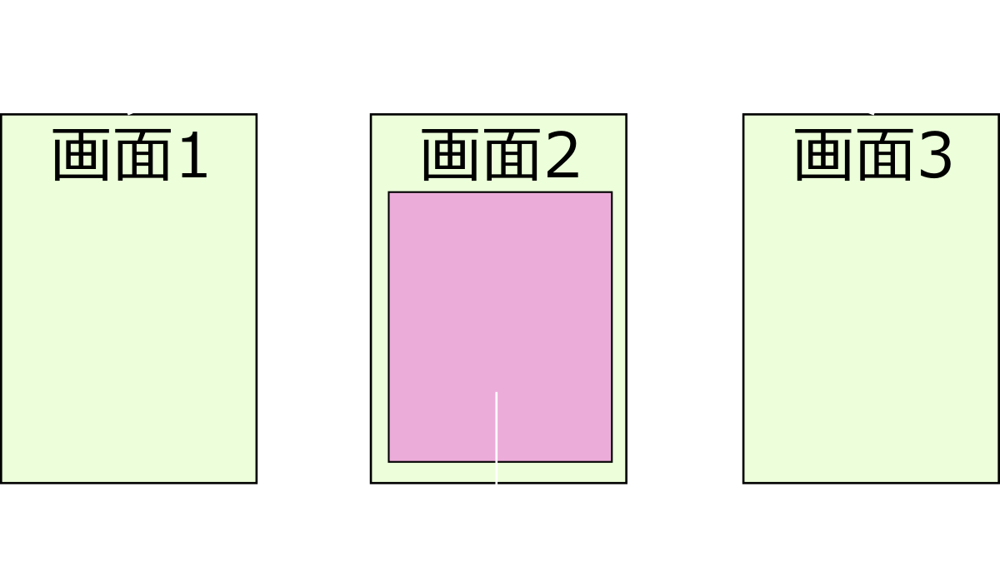

# [fit] Xamarin.Forms概要 
# [fit] 
# [jxug #1 2014.7.5](http://atnd.org/events/52408)
# [@amay077](https://twitter.com/amay077)

---

# [fit] **自己紹介**

*  奥山 裕紳（OKUYAMA Hironobu）
* 位置情報エンジニア、モバイルアプリエンジニア
* VB6 → VC6 → C#2.0 → (闇) → Java/Obj-C → C#5.0
* Cosmoroot,Inc(Nagoya, Tokyo)
* 地理情報、オープンデータ、C#、Android、iOS、**Xamarin**

---

# [fit] **個人活動**

* Androidアプリ - HexRinger、しゃべPOI、etc
* MA9 いのしし一頭賞 - 富士フォト
* オープンデータ関連コンテスト参加
* うずらインキュベータ(愛知県豊橋市のIT勉強会)
* 「Xamarin でググれ！」と言ってみたい


---

# [fit] BUILD Insider で　　
# [fit]　　
# [fit] **「[Xamarin 逆引き Tips](http://www.buildinsider.net/mobile/xamarintips)」**
# [fit]　　
# [fit] 書いています　　　　


---

# [fit] **[PR]株式会社コスモルート**
# クラウドサービスプロバイダ

* ロジネビュラ:クラウド型倉庫管理システム
* GeQuu:リアルタイムセンサデータ収集プラットフォーム
* ネプラ:基幹業務向けPaaS
* AWS テクノロジーパートナー認定
* [AWSジャパンツアー2014夏](http://tour.awseventsjapan.com/)(8.1名古屋)に社長が登壇します


---

# [fit] **目次**

1. Xamarin.Forms とはなにか？
2. プラットフォーム機能との併用
3. MVVM な機能
4. ためしにアプリを作ってみた
5. まとめ

---

# [fit] **1. Xamarin.Forms とはなにか？**

---

# [fit] **そもそも Xamarin(.iOS or .Android) とは**

* ネイティブ(iOS or Android)APIの **C#のラッパー** + <br/>　.NET BCL の iOS or Android版
* .NET BCL 部分はクロスPFで使いまわせる→PCLとか
* ネイティブAPIのラッパー部分は**使いまわせない**
	* 画面
	* カメラ、GPS、Push、アプリ連携、Beacon、etc…

---

# [fit] **Xamarin.Forms とは**

* ワンソースで複数PFの**画面**を作成できるフレームワーク
* iOS6〜, Android4〜, Windows Phone8〜 に対応
* PCL と Shared Project で作れる
* C# or XAML(WPFとは非互換) で書く
  * UIデザイナは(まだ？)ない
* MVVM な機能も含む

---

# [fit] **Xamarin.Forms とは**

* UIレンダリングはネイティブで行われる
	* たとえば ``Xamarin.Forms.Label`` は Android では ``TextView``, iOS では ``UILabel`` が使われる
* Titanium Mobile と同じ仕組み
* Adobe AIR や Delphi XE は独自レンダリング
* PhoneGap は HTML なので比較対象外

---

# [fit] **画面の定義**

```csharp
public class App {
  public static Page GetMainPage() {
    return new ContentPage { 
      Content = new Xamarin.Forms.DatePicker {
        VerticalOptions = LayoutOptions.CenterAndExpand,
        HorizontalOptions = LayoutOptions.CenterAndExpand,
      },
    };
  }
}
```

---
# [fit] **エントリポイント（iOS）**

```csharp
//using Xamarin.Forms;

public class AppDelegate : UIApplicationDelegate {
  public override bool FinishedLaunching(
  UIApplication app, NSDictionary options) {
    
  window = new UIWindow(UIScreen.MainScreen.Bounds);
  
  Forms.Init();
  window.RootViewController = App.GetMainPage()
    .CreateViewController(); // 1.

  // 以下省略
```
---
# [fit] **エントリポイント（Android）**

```csharp
//using Xamarin.Forms.Platform.Android;
//using Xamarin.Forms;

public class MainActivity : AndroidActivity { // 1.
  protected override void OnCreate(Bundle bundle) {
  base.OnCreate(bundle);

  Forms.Init(this, bundle);   // 2.
  SetPage(App.GetMainPage()); // 3.

  // 以下省略
```

---

# [fit] **実行結果**


---

# [fit] **構成要素**

* Page = 画面
* Layout = View のコンテナ(Viewでもある)
* View = コントロール

---

# [fit] **Page**


---

# [fit] **Layout**


---

# [fit] **View**


---

# [fit] **画面遷移**

```csharp
public class App {
  public static Page GetMainPage() { 
    var btn = new Button { Text = "Goto Second" };

    var navPage = new NavigationPage(new ContentPage { // 1.
      Content = btn,
    });

    btn.Clicked += (sender, e) => 
      navPage.PushAsync(App.GetSecondPage()); // 2.

    return navPage;
}}
```

---
# [fit] **アラートダイアログ**

```csharp
btn.Clicked += async (sender, e) => {
    if (await page.DisplayAlert("ご注文は", 
      "ざまりんですか？", "はい", "いいえ")) {
        btn.Text = "あざす";
}};
```


---
# [fit] **選択ダイアログ**

```csharp
var selectedText = await page.DisplayActionSheet(
  "ご注文のざまりんは？", 
  "買わない", "むしろ売りたい",
  new string[] { "INDIE", "BUSINESS", "ENTERPRISE" });
btn.Text = selectedText; // Android で BACK すると null が来る
```


---
# [fit] **分岐処理**

```csharp
// プラットフォーム毎の処理
Device.OnPlatform(() => /* Action for iOS */, 
                  () => /* Action for Android */, 
                  () => /* Action for Windows Phone */); 

// プラットフォーム
Device.OS = { iOS | Android | WinPhone }

// Phone or Tab
Device.Idiom = { Phone | Tablet }
```
「これ使ったら負け」感…。

----

# [fit] **2. プラットフォーム機能との併用**

----

# [fit] **プラットフォーム機能を使いたい時とは？**

* いきなり Forms に移行するとかムリ
  * 例: .axml/.storyboard アプリの一部に Forms を使う
* Forms の部品に足りない機能がある
  * 既存のViewの拡張(例:ButtonにLongTapイベントを付ける)
  * まったく新しいViewを作る
* 画面以外の機能を使いたい(GPSとか)

---

# [fit] .axml/.storyboard アプリの一部に Forms を使う

---

# [fit] **[iOS]Storyboard の一部に Forms**


---

# [fit] **Forms を適用したい ViewController の実装**

```csharp
partial class SecondViewController : UIViewController {
  public override void ViewDidLoad() {
      base.ViewDidLoad();
      Forms.Init(); // 初期化
      // Page→ViewController
      var page = new MainPage();
      var vc = page.CreateViewController();
      // Page 側のボタンのイベントハンドラ(画面遷移)
      page.GotoThirdButton.Clicked += (sender, e) => 
        this.PerformSegue("goto_third", this);
      // Pageを親ViewControllerに追加
      this.AddChildViewController(vc);
      this.View.Add(vc.View);
      vc.DidMoveToParentViewController(this);
  }}
```

---

# [fit] **[iOS]実行結果**


---
# [fit] **[Android]Activity の一部に Forms**




---

# [fit] **Forms を適用したい Activity の実装**

```csharp
public class SecondActivity : AndroidActivity {
  protected override void OnCreate(Bundle bundle) {
    base.OnCreate(bundle);
    Forms.Init(this, bundle); // 初期化
    // Page生成
    var page = new MainPage();
    // Page 側のボタンのイベントハンドラ(画面遷移)
    page.GotoThirdButton.Clicked += (sender, e) =>
      StartActivity(typeof(ThirdActivity));
    // Pageを設定
    this.SetPage(new NavigationPage(page));
}}
```
---

# [fit] **[Android]実行結果**


---

# [fit] Forms の部品を拡張する
# [fit] 
# [fit] Forms.ButtonにLongTapイベントを追加する

---

# [fit] **[Forms]``Button``を拡張した``MyButton``を用意**

```csharp
public class MyButton : Xamarin.Forms.Button {
    // イベント
    public event EventHandler LongTap;
    // イベント発火用
    public void OnLongTap() {
        if (this.LongTap != null)
            this.LongTap(this, new EventArgs());
    }
}
```

---
# [fit] **[Android]Renderer を実装して Export する**

```csharp
// ↓↓ 超重要！ ↓↓
[assembly:ExportRenderer(typeof(MyButton), typeof(MyButtonRenderer))]

public class MyButtonRenderer : ButtonRenderer {
  protected override void OnElementChanged(
      ElementChangedEventArgs<Button> e) {
      base.OnElementChanged(e);
      var formsButton = e.NewElement as MyButton; // FormsのButton
      var droidButton = this.Control; // AndroidのButton
      droidButton.LongClick += (sender, _) => 
        formsButton.OnLongTap();
}}
```

---
# [fit] **[iOS]Renderer を実装して Export する**

```csharp
// ↓↓ 超重要！ ↓↓
[assembly:ExportRenderer(typeof(MyButton), typeof(MyButtonRenderer))]

public class MyButtonRenderer : ButtonRenderer {
  protected override void OnElementChanged(
    ElementChangedEventArgs<Button> e) {
    base.OnElementChanged(e);
    UIButton iosButton = this.Control; // iOSのButton
    iosButton.AddGestureRecognizer(new UILongPressGestureRecognizer(x => {
      if (x.State == UIGestureRecognizerState.Recognized) 
        (e.NewElement as MyButton).OnLongTap();
    }));
}}
```

---

# [fit] **[Forms]MyButton を使う**

```csharp
public class App {
  public static Page GetMainPage() {
    var button = new MyButton {
      Text = "Long tap me"
    };

    button.LongTap += (sender, e) => 
      button.Text = "On long tapped";

    return new ContentPage { 
      Content = button
    };
}}
```

---

# [fit] **[Forms]実行結果**


---

# [fit] **まったく新しいViewをつくる(iOSでの例)**


```csharp
// Forms:MyMapView.cs
public class MyMapView : Xamarin.Forms.View { }
-----------------------------------------------------------------------
//iOS:MyMapViewRenderer.cs
[assembly:ExportRenderer(typeof(MyMapView), typeof(MyMapViewRenderer))]

public class MyMapViewRenderer : 
    ViewRenderer<MyMapView, MonoTouch.MapKit.MKMapView> {
  protected override void OnElementChanged (
      ElementChangedEventArgs<MyMapView> e) {
    base.OnElementChanged(e);
    // 独自のコントロールに置き換えちゃう
    SetNativeControl(new MonoTouch.MapKit.MKMapView());
}}
```

---

# [fit] **Pageもさわれる(iOSでの例)**

Forms の画面に、さらに ``UILabel`` を追加する

```csharp
[assembly:ExportRenderer(typeof(SecondPage), typeof(MyPageRenderer))]

public class MyPageRenderer : PageRenderer {
  protected override void OnElementChanged(
      VisualElementChangedEventArgs e) {
    base.OnElementChanged(e);

    NativeView.Add (new UILabel (new RectangleF(0, 100, 300, 40)) {
        Text = "Render by MyPageRenderer"
    });       
}}
```

---

# [fit] **Xamarin.Forms + ネイティブ画面開発**

* ``ExportRenderer`` とても便利
* ネイティブ側の実装も __同じ世界の中でできる__！
  * XS or VS でデバッグできる
  * ネイティブAPIのラッパーのおかげ
  * Titanium や AIR ではこうはいかない

---

# [fit] 画面以外のプラットフォーム固有機能を使う
# [fit] 
# 「端末の名称」を取得する

---

# [fit] **[Forms]**共通のインターフェースを定義する

* いわゆる「DI」の機能
* プラットフォームに応じたインスタンスを``DependencyService``が返してくれる

まずはインターフェース。

```csharp
public interface IDeviceInfo {
  string DeviceName { get; }
}
```

---

# [fit] **[iOS/Andrid]プラットフォーム側の実装**

```csharp
// DeviceInfo_iOS.cs
[assembly: Xamarin.Forms.Dependency (typeof (DeviceInfo_iOS))] // これ重要！
public class DeviceInfo_iOS : IDeviceInfo {
  public string DeviceName {
    get { return UIDevice.CurrentDevice.Name; } // iOSの実装
  }
}

------------------------------------------------------------------
// DeviceInfo_Android.cs
[assembly: Xamarin.Forms.Dependency (typeof (DeviceInfo_Android))]
public class DeviceInfo_Android : IDeviceInfo {
  public string DeviceName {
    get { return Android.OS.Build.Device; } // Android の実装
  }
}
```

---

# [fit] **[Forms]IDeviceInfo を使う**

```csharp
public class App {
  public static Page GetMainPage() {
    var button = new Button { Text = "Get device name" };

    // 実行しているプラットフォームの DeviceInfo を生成
    // 対応してない時は null
    var info = DependencyService.Get<IDeviceInfo>();

    button.LongTap += (sender, e) => 
      button.Text = info != null ? info.DeviceName : String.Empty;

    return new ContentPage { Content = button };
}}
```

---

# [fit] **3. MVVM な機能**
# [fit]
# [fit]
# [fit]
# [fit]
# [fit]
# [fit]


---

# [fit] **ViewModel - INotifyPropertyChanged**

```csharp
public class MyViewModel : INotifyPropertyChanged {
  public event PropertyChangedEventHandler PropertyChanged;

  string _myName;
  public string MyName {
    get { return _myName; }
    set { 
        if (_myName == value) return;
        _myName = value;
        // だいぶ端折ってますが
        PropertyChanged(this, new PropertyChangedEventArgs("MyName"));
    }
..続く..
```

---

# [fit] **ViewModel - ICommand**

```csharp
..続き..
  ICommand _resetCommand;
  public ICommand ResetCommand {
    get {
      return _resetCommand ?? (_resetCommand = 
        new Xamarin.Forms.Command(() => {
          MyName = "xamariiiiin!!";
        }));
    }
}}
```

MS系のみなさまにはお馴染みのコードかと存じます。

---

# [fit] **DataBinding**

```csharp
public class MyPage : ContentPage {
  public MyPage() {
    var editBox = new Entry {  };
    var label = new Label {  };
    var button = new Button { Text = "Reset" };

    this.BindingContext = new MyViewModel();
    editBox.SetBinding(Entry.TextProperty, "MyName");
    label.SetBinding(Label.TextProperty, "MyName");
    button.SetBinding(Button.CommandProperty, "ResetCommand");
}}
```

普通にできます。


---


# [fit] **Messenger**

receiver : 大抵は View
sender   : 大抵は ViewModel

```csharp
// メッセージ待ち受け側
MessagingCenter.Subscribe<TSender, string>(
    receiver, "messageId", (sender, param) => 
    label.Text = param; }; 

-------------------------------------------------------
// メッセージ送信側
MessagingCenter.Send(sender, "messageId", "param");
```

``DisplayAlert`` などで使われているもよう。

---

# [fit] **他の MVVM ライブラリと混ぜられる？**

* MvvmCross とか
* ``ICommand``, ``INotifyPropertyChanged`` なVMは使えそう
* FormsのVMは、``Xamarin.Forms.Command``とか``MessagingCenter``など使ってると他ではダメ
* Modelも、``DependencyService``を使ってると他ではダメ
* 上記を抽象化すれば使えそうだけど、そこまでやる？

---

# [fit] **Forms 非対応PFとまぜられる？**

* WPF、WinStore、Xamarin.Mac、Sil(ry
* Xamarin.Forms 名前空間を使ってる所はまぜられない
* 前頁の通り、``ICommand``, ``INotifyPropertyChanged`` なVMは使えるかも
* 実質、Model内のビジネスロジックくらい
* Windows Univarsal Apps はわかりません

---

# [fit] **4. ためしにアプリを作ってみた**

---

# [fit] **PakaPakaCalc by Xamarin.Forms**

* 「フラッシュ暗算」のアプリ
* iPhone、iPad、Android 対応(WPもってない)
* 画面はすべて Forms 側で実装
* XAML化に備えて ``MyView.cs`` と ``MyView.desiner.cs`` に分離
* アプリケーション情報の保存は PCLStorage + JSON.NET

---

# [fit] **DEMO**


---

# [fit] **4. まとめ**

---

# [fit] **Xamarin.Forms まとめ**

* iOS/Android/WP で、ワンソースでUIを構築できる
* 足りない機能もあるけど、拡張がとても簡単
* MVVM が普通に使える
* ロックイン注意、というか「モバイル向け」と割りきって
* はやくUIデザイナおねがいします

---

# [fit] **Links**

* [Xamarin.Forms | Xamarin](http://developer.xamarin.com/guides/cross-platform/xamarin-forms/)
* [Xamarin.Formsの基本構想と仕組み - Build Insider](http://www.buildinsider.net/mobile/insidexamarin/14)
* [Xamarin逆引きTips - Build Insider](http://www.buildinsider.net/mobile/xamarintips)
* [xamarin/xamarin-forms-samples](https://github.com/xamarin/xamarin-forms-samples)
* [XForms/Xamarin-Forms-Labs](https://github.com/XForms/Xamarin-Forms-Labs)
* [NuGet Gallery | Xamarin.Forms](http://www.nuget.org/packages/Xamarin.Forms/)

---

# [fit] ありがとうございました

---

# [fit] **Tips じゃない Tips**

* NuGet から頻繁に更新を（今の最新は 1.1.1.6206、プロジェクト作成直後は古い）
* 画面サイズから文字サイズをスケーリング(手動)
* iOSのステータスバーの為の ``Device.OnPlatform(20,0,0)`` …ひどい
* [Xamarin.Formsでキーボードに隠れないようにレイアウトをずらすハック](http://qiita.com/wilfrem/items/af5cc21f08dc4a4e4249) by @WilfremLuminous さん


